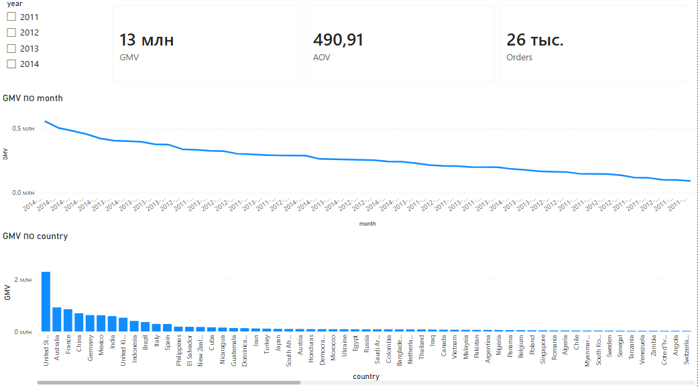
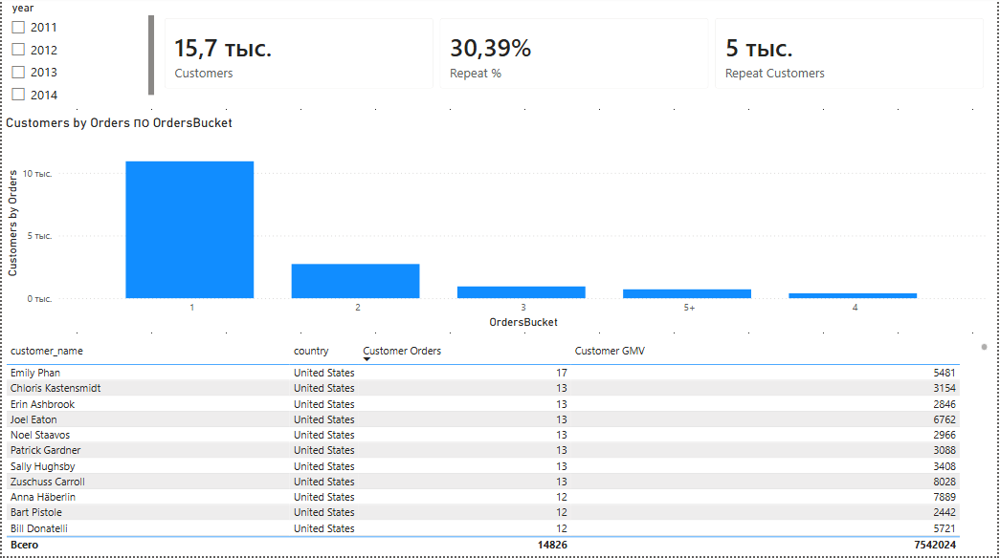
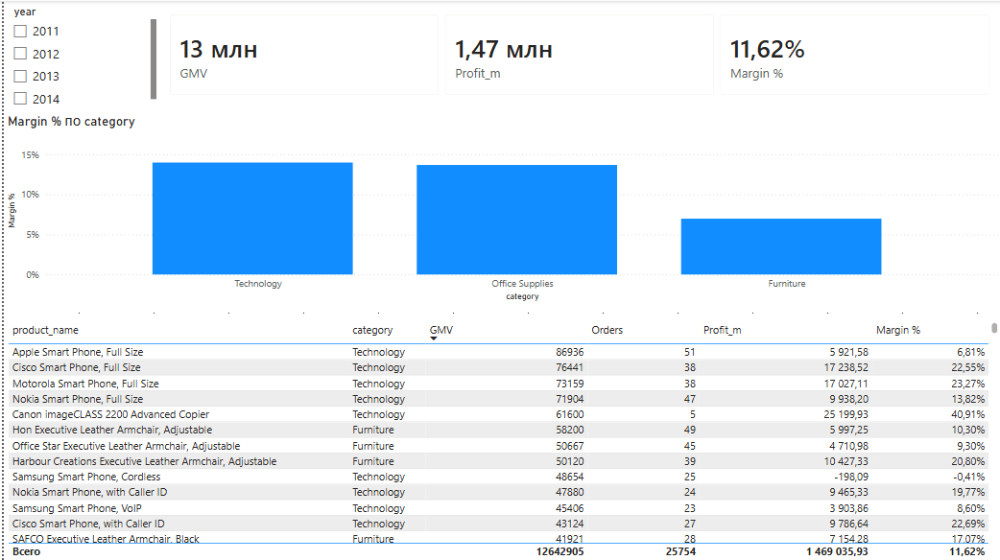

# SuperStore Sales Analytics

Пет-проект: e-commerce аналитика от CSV до дашборда Power BI.  
Датасет: https://www.kaggle.com/datasets/thuandao/superstore-sales-analytics  
Период: **2011–2014**.

Python → MySQL → Power BI. Метрики сверены между слоями.

---

## О чём проект

| Слой | Что делает |
|------|------------|
| **Python** | ETL, ключи, parquet, контрольные метрики |
| **SQL (MySQL)** | схема, views, KPI-запросы |
| **Power BI** | дашборд, 3 страницы |

**Маршрут ABC:**
- **A** — GMV, AOV, страна, месяцы
- **B** — repeat, когорты, LTV
- **C** — маржа, топ товары

**Метрики:** GMV = `SUM(sales)`, AOV = GMV / orders, маржа = `SUM(profit) / SUM(sales)` (не среднее по строкам).

---

## Данные и ETL

Исходник: **51 290 строк**, 21 колонка, пустых нет. Период 2011–2014, даты в формате дд/мм/гггг.

**Зерно — line** (позиция в заказе): 51 290 строк vs 25 035 `order_id` (~2 позиции на заказ).

**Чистка:**
- отмен и status в данных нет
- `sales <= 0` — 1 строка, отфильтрована → **51 289** строк clean
- `sales` пришёл строкой с запятыми → `to_numeric`
- даты: `dayfirst=True`
- `ship_days` = ship_date − order_date, отрицательных нет

**Ключи** (660 `order_id` с разными клиентом/датой на один id):
- `customer_key` = имя + страна → **15 700** клиентов
- `order_key` = order_id + дата + имя + страна → **25 754** заказа

Заказы для GMV/AOV считаем по **`order_key`**, не по `order_id`.

---

## Ключевые находки

**Продажи**
- GMV **12 642 905**, orders **25 754**, AOV **~491**, lines **51 289**
- Топ страны: **United States → Australia → France**
- Динамика по месяцам: хвост 2014 — осень/зима (смотреть с учётом неполного года)

**Клиенты**
- **15 700** клиентов, repeat **~30.4%** (2+ заказа)
- LTV median **~341**

**Продукты**
- Маржа по category: **Technology / Office Supplies ~14%**, **Furniture ~7%**
- Общая маржа **~11.6%**
- Топ GMV: **Apple Smart Phone**, **Canon imageCLASS**, **Cisco SPA**

Цифры совпадают в `report.py`, SQL (`04_kpi_totals`) и карточках Power BI.

---

## Дашборд

| Файл | Страница |
|------|----------|
| `powerbi/screenshots/01_overview.png` | Overview |
| `powerbi/screenshots/02_customers.png` | Customers |
| `powerbi/screenshots/03_products.png` | Products |

### Overview


### Customers


### Products


Готовый отчёт: `powerbi/SuperStore_Dashboard.pbix`

- **Overview** — GMV, Orders, AOV + динамика по месяцам + GMV по странам
- **Customers** — repeat, распределение заказов на клиента, топ repeat-клиенты
- **Products** — маржа по category, товаров по GMV

---

## Pipeline

```text
data/SuperStoreOrders - SuperStoreOrders.csv
        │
        ├─► scripts/pipeline.py  -  clean + keys → data/processed/*.parquet
        ├─► scripts/report.py  - метрики ABC, сверка
        ├─► scripts/load_mysql.py  - parquet → MySQL (superstore)
        ├─► sql/01_schema.sql … 09  - views, sanity, KPI
        └─► powerbi/  -  дашборд + скрины
```

| Файл | Назначение |
|------|------------|
| `scripts/pipeline.py` | загрузка, типы, чистка, ключи, parquet |
| `scripts/report.py` | GMV / AOV / repeat / когорты / margin |
| `scripts/load_mysql.py` | parquet → MySQL |
| `sql/01_schema.sql` | база `superstore`, таблицы |
| `sql/02_views.sql` | `people_orders`, `customer_agg` |
| `sql/03_sanity.sql` | проверки после загрузки |
| `sql/04`–`09_kpi_*.sql` | totals, страна, месяцы, margin, repeat, когорты |

---

## Power BI — модель

```text
dim_date[Date]                    → clean_orders[order_date]      (*:1)
superstore people[customer_key]   → clean_orders[customer_key]   (1:*)
```

```dax
GMV = SUM('superstore clean_orders'[sales])
Orders = DISTINCTCOUNT('superstore clean_orders'[order_key])
AOV = DIVIDE([GMV], [Orders])
Margin % = DIVIDE(SUM('superstore clean_orders'[profit]), [GMV])
```

---

## Стек

Python (pandas, pyarrow) → MySQL 8 → Power BI Desktop (DAX).

---

## Автор

@cat_main
